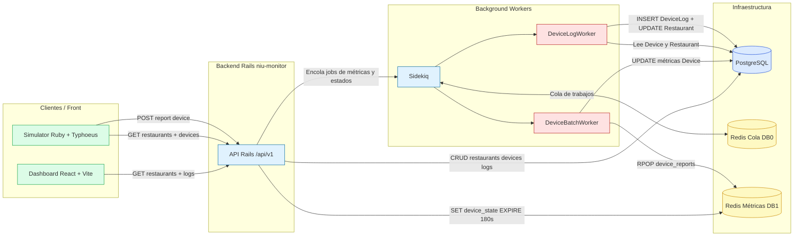
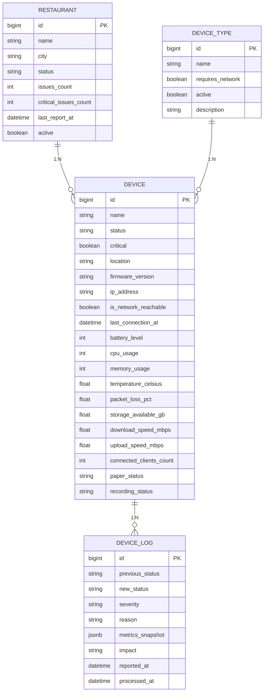
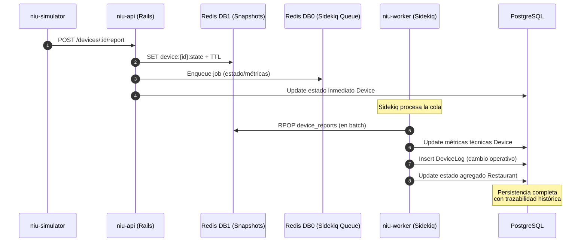

# Sistema de Monitoreo Centralizado de Dispositivos — Niufoods

Este proyecto corresponde al desarrollo de una solución solicitada como prueba técnica para la franquicia Niufoods. El objetivo es implementar un sistema centralizado de monitoreo de hardware instalado en múltiples restaurantes, considerando la operación real de dispositivos tales como terminales POS, impresoras de cocina, pantallas, routers y otros equipos utilizados en el funcionamiento diario.

Cada restaurante debe ser capaz de enviar periódicamente información sobre el estado de sus dispositivos a una API central desarrollada en Ruby on Rails, la cual debe validar los datos, procesarlos, generar registros históricos y actualizar el estado tanto del dispositivo como del restaurante. La base de datos utilizada es PostgreSQL, y se incorpora el uso de Sidekiq como mecanismo de procesamiento asíncrono para garantizar eficiencia y alta disponibilidad.

Adicionalmente, se incluye un script simulador que actúa como uno o más restaurantes, enviando datos a la API en intervalos regulares, con estados cambiantes y posible manejo de errores de validación. Finalmente, se integra un panel web que permite visualizar el estado general de los restaurantes y de cada uno de sus dispositivos, cumpliendo con los requerimientos de visualización solicitados.

---

## Arquitectura General

- El sistema opera bajo un modelo centralizado donde cada restaurante reporta el estado de sus dispositivos a la API principal.
- La API Ruby on Rails valida payloads, aplica strong params, actualiza métricas y produce registros persistentes en PostgreSQL.
- Los cambios de estado o métricas se derivan a Sidekiq para procesamiento asíncrono, permitiendo alta concurrencia sin bloquear solicitudes.
- Redis cumple doble propósito: cola de trabajos (Sidekiq) y almacenamiento temporal de snapshots operacionales para reducción de lecturas a base de datos.
- Un simulador externo envía reportes HTTP concurrentes, reproduciendo condiciones reales de operación y posibles fallos.
- Un dashboard web consume la API y muestra el estado operacional de restaurantes y dispositivos, utilizando snapshots y consultas optimizadas.



---

## Modelo de Datos (ERD)

El modelo de datos se estructura para permitir la trazabilidad operacional de cada dispositivo instalado en los restaurantes. Los elementos principales son:

- `Restaurant` mantiene el estado agregado según los dispositivos conectados (conteo de fallas, problemas críticos, última actualización).
- `Device` almacena información de estado en tiempo real, junto con métricas que pueden variar según el tipo de hardware.
- `DeviceType` clasifica los dispositivos en categorías técnicas (POS, router, impresora fiscal, pantalla de cocina, etc.) y define si requieren conectividad de red.
- `DeviceLog` documenta cada cambio operativo o anomalía detectada, vinculando el motivo, severidad y métricas asociadas.


___

## Flujo de Procesamiento (API + Workers + Redis)

El procesamiento de reportes y métricas se ejecuta de forma asíncrona para garantizar baja latencia y alta concurrencia. El flujo técnico es el siguiente:

- La API Rails valida el payload recibido, normaliza los parámetros y actualiza el estado inmediato del dispositivo.
- Los cambios relevantes (estado operativo o métricas) generan tareas en segundo plano, delegadas a Sidekiq.
- Redis (DB0) se utiliza como backend de colas, permitiendo paralelismo en procesamiento y encolamiento masivo.
- Redis (DB1) almacena snapshots temporales del estado de cada dispositivo para disminuir lectura repetitiva en la base de datos.
- `DeviceBatchWorker` procesa lotes de reportes desde Redis, actualizando métricas técnicas en tabla `Device`.
- `DeviceLogWorker` registra cambios relevantes, calculando severidad e impacto según el tipo de dispositivo y sus métricas.
- `Restaurant` actualiza su estado agregado (críticos, fallas, operativos) cada vez que se procesan logs de dispositivos asociados.




---
## Infraestructura con Docker

El sistema se despliega mediante múltiples contenedores coordinados por Docker Compose. Cada servicio está aislado según su responsabilidad técnica: API, procesamiento asíncrono, persistencia, caché/colas, simulación y dashboard. Redis se utiliza en doble rol: backend de colas (DB0) y almacenamiento temporal de snapshots operacionales (DB1). Sidekiq se ejecuta como un proceso independiente dentro del contenedor `niu-worker`.

### Servicios y contenedores

| Componente | Imagen/Base | Contenedor | Función |
|------------|-------------|------------|---------|
| API Rails | ruby:3.2 + Rails 8 | `niu-api` | Exposición de endpoints REST, validación, snapshot, encolamiento de tareas |
| Worker Sidekiq | ruby:3.2 | `niu-worker` | Procesamiento asíncrono de logs y métricas |
| Dashboard Web | Node + React | `niu-dashboard` | Visualización del estado de restaurantes y dispositivos |
| Simulador | ruby:3.2 | `niu-simulator` | Generación de carga operativa y envío de reportes HTTP |
| Base de datos | postgres:16 | `niu-db` | Persistencia relacional y trazabilidad histórica |
| Redis | redis:7 | `niu-redis` | Colas de Sidekiq (DB0) y snapshots de dispositivos (DB1) |

### Configuración base

```yaml
services:
  db:
    image: postgres:16
    container_name: niu-db
    environment:
      POSTGRES_USER: postgres
      POSTGRES_PASSWORD: postgres
      POSTGRES_DB: niu_monitor_development
    ports:
      - "5432:5432"
    volumes:
      - pgdata:/var/lib/postgresql/data

  redis:
    image: redis:7
    container_name: niu-redis
    ports:
      - "6379:6379"

  api:
    build: ./niu-monitor
    container_name: niu-api
    command: bash -c "rm -f tmp/pids/server.pid && rails s -b 0.0.0.0 -p 3000"
    environment:
      DATABASE_URL: postgres://postgres:postgres@db:5432/niu_monitor_development
      REDIS_URL: redis://redis:6379/0
    depends_on:
      - db
      - redis
    ports:
      - "3000:3000"

  worker:
    build: ./niu-monitor
    container_name: niu-worker
    command: ["bundle", "exec", "sidekiq", "-C", "config/sidekiq.yml"]
    environment:
      DATABASE_URL: postgres://postgres:postgres@db:5432/niu_monitor_development
      REDIS_URL: redis://redis:6379/0
      REDIS_METRICS_URL: redis://redis:6379/1
    depends_on:
      - db
      - redis

  dashboard:
    build: ./niufoods-dashboard
    container_name: niu-dashboard
    command: ["npm", "run", "dev", "--", "--host"]
    ports:
      - "5173:5173"
    depends_on:
      - api

  simulator:
    build: ./simulator
    container_name: niu-simulator
    environment:
      SIM_API_URL: http://niu-api:3000/api/v1
      SIM_DEVICES: 30
      SIM_THREADS: 15
    depends_on:
      api:
        condition: service_healthy

volumes:
  pgdata:
```

## Backend — API (Rails 8 + Sidekiq)

La API expone puntos de interacción para: consultar el estado de restaurantes y dispositivos, registrar métricas operacionales enviadas desde dispositivos remotos y generar trazabilidad mediante logs persistentes. Rails aplica validación de parámetros mediante Strong Params, encolado de tareas asíncronas y actualización del estado agregado del restaurante.

### Endpoints principales (REST)

| Método | Ruta | Descripción | Respuesta |
|--------|------|-------------|-----------|
| `GET` | `/api/v1/restaurants` | Obtiene todos los restaurantes monitoreados con su estado agregado | Lista `Restaurant` con estado global |
| `GET` | `/api/v1/restaurants/:id` | Obtiene el detalle del restaurante y sus dispositivos asociados | `Restaurant` + listado de `Device` |
| `GET` | `/api/v1/restaurants/:id/devices` | Lista solo los dispositivos del restaurante especificado | Listado `Device` |
| `POST` | `/api/v1/devices/:id/report` | Reporte operativo desde restaurante (status + métricas) | `202 Accepted` si fue encolado correctamente |
| `GET` | `/api/v1/devices/:id/logs?limit={n}` | Últimos logs del dispositivo (límite configurable) | Lista `DeviceLog` serializada |

### Comportamiento técnico por endpoint

- `POST /devices/:id/report`
  - Valida payload e ignora campos no permitidos vía Strong Params.
  - Actualiza estado inmediato en `Device`.
  - Encola análisis de métricas y registro en `DeviceLog` mediante Sidekiq.
  - Guarda snapshot temporal en Redis (DB1) con TTL.

- `GET /restaurants/:id`
  - Calcula severidad del restaurante a partir del estado agregado de sus dispositivos.
  - Devuelve listado de dispositivos con atributos relevantes para visualización (ubicación, estado, última conexión, conectividad).

- `GET /devices/:id/logs`
  - Expone trazabilidad histórica contra la tabla `DeviceLog`.
  - Permite paginación parcial vía parámetro `limit`.

### Workers relacionados a la API

| Worker | Rol | Fuente de datos |
|--------|-----|-----------------|
| `DeviceBatchWorker` | Procesa lotes de métricas desde Redis, actualizando `Device` | Cola en Redis DB1 |
| `DeviceLogWorker` | Registra cambios operativos y su impacto, luego actualiza `Restaurant` | Device + métricas procesadas |

---


### Despliegue de la solución

```bash
# 1) Clonar el repositorio
git clone https://github.com/ascciboy/NiuFoods-Test.git
cd NiuFoods-Test

# 2) Constrir imagenes y levantar servicios
docker compose up -d --build

# 3) Ver estado de los contenedores
docker compose ps

# 4) Ejecutar migraciones - por si llegara a fallar el DockerFile
docker compose exec niu-api bin/rails db:migrate

# 5) Ejecutar seeds - Tambien lo ejecuta el docjerFile, pero se puede ejecutar asi.
docker compose exec niu-api bin/rails db:seed

# 6) Ver logs (API o Worker)
docker compose logs -f niu-api
docker compose logs -f niu-worker

# 7) Reiniciar un servicio
docker compose restart niu-api
docker compose restart niu-worker

# 8) Entrar a Rails Console
docker compose exec niu-api bin/rails console

# 9) Apagar servicios
docker compose down

# 10) Apagar y borrar volúmenes (elimina DB)
docker compose down -v
